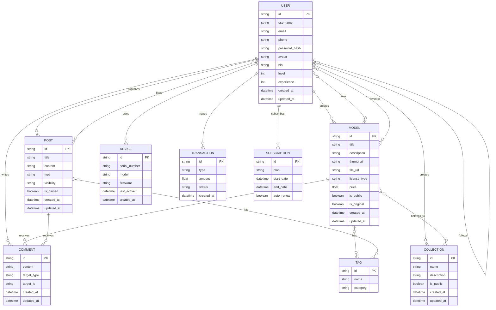

# MakeraWorld系统设计文档

## 1. 概述

MakeraWorld是一个面向创客和设计师的3D模型设计与制造平台，旨在连接全球创客社区，提供模型分享、社区互动、云端CAM处理和设备控制等功能。该平台致力于降低数字制造的门槛，促进创意共享与协作，打造一个完整的创客生态系统。


系统包括以下核心功能模块：
- 用户管理：注册、登录、个人中心、粉丝关系等
- 内容管理：模型上传、展示、预览、版本控制等
- 社区互动：评论、点赞、收藏、分享、私信等
- MakeraCloud：云存储、云端CAM、设备控制等
- 创客工具：模型处理、优化、转换等工具集
- 商业模块：积分系统、会员订阅、交易系统等
- 搜索推荐：内容搜索、个性化推荐等
- 国际化：多语言支持、本地化内容等

## 2. 系统架构

### 2.1 总体架构图


## 3. 核心模块设计

### 3.1 用户模块

#### 3.1.1 用户模块架构


#### 3.1.2 用户注册流程


### 3.2 内容模块

#### 3.2.1 内容模块架构


#### 3.2.2 模型上传流程


### 3.3 社区模块

#### 3.3.1 社区模块架构


#### 3.3.2 社区互动流程


### 3.4 MakeraCloud模块

#### 3.4.1 MakeraCloud架构


#### 3.4.2 MakeraCloud工作流程


### 3.5 创客工具模块

#### 3.5.1 创客工具架构


#### 3.5.2 AI辅助创作流程


### 3.6 商业模块

#### 3.6.1 商业模块架构


#### 3.6.2 模型交易流程


### 3.7 搜索与推荐模块

#### 3.7.1 搜索与推荐架构


#### 3.7.2 智能推荐流程


## 4. 数据模型设计

### 4.1 核心数据实体关系图



## 5. 接口设计

### 5.1 API接口规范

- 采用RESTful API设计风格
- 使用HTTPS协议确保传输安全
- 接口版本控制：在URL中包含版本号，如`/api/v1/resource`
- 统一的响应格式：
  ```json
  {
    "code": 200,
    "message": "操作成功",
    "data": {},
    "timestamp": 1629123456789
  }
  ```
- 错误处理：使用HTTP状态码表示请求状态，详细错误信息在响应体中提供
- 分页处理：支持limit/offset和cursor两种分页方式
- 权限控制：基于JWT的认证和基于角色的授权

### 5.2 核心API示例

#### 用户API

```
# 用户注册
POST /api/v1/users/register

# 用户登录
POST /api/v1/users/login

# 获取用户信息
GET /api/v1/users/{userId}

# 更新用户信息
PUT /api/v1/users/{userId}

# 关注用户
POST /api/v1/users/{userId}/follow

# 获取用户关注列表
GET /api/v1/users/{userId}/following

# 获取用户粉丝列表
GET /api/v1/users/{userId}/followers

# 获取用户作品列表
GET /api/v1/users/{userId}/models

# 获取用户动态
GET /api/v1/users/{userId}/activities
```

#### 模型API

```
# 获取模型详情
GET /api/v1/models/{modelId}

# 更新模型信息
PUT /api/v1/models/{modelId}

# 删除模型
DELETE /api/v1/models/{modelId}

# 获取模型评论
GET /api/v1/models/{modelId}/comments

# 添加模型评论
POST /api/v1/models/{modelId}/comments

# 获取模型版本历史
GET /api/v1/models/{modelId}/versions

# 创建新版本
POST /api/v1/models/{modelId}/versions

# 模型点赞
POST /api/v1/models/{modelId}/like

# 模型收藏
POST /api/v1/models/{modelId}/favorite

# 模型分享
POST /api/v1/models/{modelId}/share
```

### 5.3 其他API示例

#### 内容API

```
# 获取所有模型
GET /api/v1/models

# 获取特定分类的模型
GET /api/v1/models?category=CNC

# 搜索模型
GET /api/v1/models/search?q=关键词

# 获取热门模型
GET /api/v1/models/trending

# 获取最新模型
GET /api/v1/models/latest

# 获取推荐模型
GET /api/v1/models/recommended

# 获取标签列表
GET /api/v1/tags

# 获取特定标签的模型
GET /api/v1/tags/{tagId}/models
```

#### 社区API

```
# 获取所有帖子
GET /api/v1/posts

# 创建帖子
POST /api/v1/posts

# 获取帖子详情
GET /api/v1/posts/{postId}

# 更新帖子
PUT /api/v1/posts/{postId}

# 删除帖子
DELETE /api/v1/posts/{postId}

# 获取帖子评论
GET /api/v1/posts/{postId}/comments

# 添加帖子评论
POST /api/v1/posts/{postId}/comments

# 帖子点赞
POST /api/v1/posts/{postId}/like

# 获取问答列表
GET /api/v1/questions

# 创建问题
POST /api/v1/questions

# 回答问题
POST /api/v1/questions/{questionId}/answers

# 标记最佳答案
PUT /api/v1/questions/{questionId}/answers/{answerId}/best
```

#### 交易API

```
# 创建订单
POST /api/v1/orders

# 获取订单详情
GET /api/v1/orders/{orderId}

# 支付订单
POST /api/v1/orders/{orderId}/pay

# 获取交易记录
GET /api/v1/transactions

# 获取用户交易记录
GET /api/v1/users/{userId}/transactions

# 创建退款请求
POST /api/v1/orders/{orderId}/refund

# 获取创作者收益统计
GET /api/v1/users/{userId}/earnings

# 申请提现
POST /api/v1/withdrawals
```

#### 搜索与推荐API

```
# 全局搜索
GET /api/v1/search?q=关键词

# 高级搜索
GET /api/v1/search/advanced

# 获取推荐模型
GET /api/v1/recommendations/models

# 获取推荐创作者
GET /api/v1/recommendations/creators

# 获取推荐帖子
GET /api/v1/recommendations/posts

# 获取个性化首页内容
GET /api/v1/recommendations/home

# 获取相似模型
GET /api/v1/models/{modelId}/similar
```

#### MakeraCloud API

```
# 获取云存储模型列表
GET /api/v1/cloud/models

# 上传模型到云存储
POST /api/v1/cloud/models

# 生成刀路
POST /api/v1/cloud/toolpaths

# 获取刀路列表
GET /api/v1/cloud/toolpaths

# 获取设备列表
GET /api/v1/cloud/devices

# 发送加工任务到设备
POST /api/v1/cloud/devices/{deviceId}/jobs

# 获取设备状态
GET /api/v1/cloud/devices/{deviceId}/status

# 获取加工任务列表
GET /api/v1/cloud/jobs

# 获取加工任务详情
GET /api/v1/cloud/jobs/{jobId}

# 取消加工任务
DELETE /api/v1/cloud/jobs/{jobId}
```

#### 创客工具API

```
# 获取工具列表
GET /api/v1/tools

# 图片质量增强
POST /api/v1/tools/image-enhance

# 图片转灰度
POST /api/v1/tools/image-grayscale

# 图片生成浮雕
POST /api/v1/tools/image-to-relief

# 图片生成3D模型
POST /api/v1/tools/image-to-3d

# 格式转换
POST /api/v1/tools/format-convert

# 模型优化
POST /api/v1/tools/model-optimize

# 参数计算
POST /api/v1/tools/parameter-calculate

# 材料用量估算
POST /api/v1/tools/material-estimate

# 成本计算
POST /api/v1/tools/cost-calculate
```

## 6. 安全设计

### 6.1 安全架构


### 6.2 数据安全流程


## 7. 部署架构

### 7.1 部署架构图


### 7.2 容器编排架构


## 8. 性能优化

### 8.1 性能优化策略

```mermaid
graph TD
    A[性能优化] --> B[前端优化]
    A --> C[API优化]
    A --> D[数据库优化]
    A --> E[缓存策略]
    A --> F[分布式计算]
    
    B --> B1[资源压缩]
    B --> B2[懒加载]
    B --> B3[CDN加速]
    B --> B4[浏览器缓存]
    B --> B5[代码分割]
    B --> B6[预渲染]
    
    C --> C1[API聚合]
    C --> C2[分页优化]
    C --> C3[字段筛选]
    C --> C4[压缩传输]
    C --> C5[异步处理]
    
    D --> D1[索引优化]
    D --> D2[查询优化]
    D --> D3[分库分表]
    D --> D4[读写分离]
    D --> D5[慢查询监控]
    
    E --> E1[多级缓存]
    E --> E2[热点数据缓存]
    E --> E3[缓存预热]
    E --> E4[缓存更新策略]
    E --> E5[分布式缓存]
    
    F --> F1[任务分解]
    F --> F2[并行计算]
    F --> F3[资源隔离]
    F --> F4[负载均衡]
    F --> F5[弹性伸缩]
```

### 8.2 3D模型加载优化流程

```mermaid
sequenceDiagram
    participant 用户
    participant 前端
    participant CDN
    participant API服务
    participant 存储服务
    
    用户->>前端: 请求查看3D模型
    前端->>API服务: 请求模型元数据
    API服务->>前端: 返回模型元数据和预览URL
    前端->>用户: 显示模型基本信息和缩略图
    
    前端->>前端: 检测用户设备性能
    
    alt 高性能设备
        前端->>CDN: 请求高精度模型
        CDN->>存储服务: 获取高精度模型
        存储服务->>CDN: 返回高精度模型
        CDN->>前端: 返回高精度模型
    else 中等性能设备
        前端->>CDN: 请求中等精度模型
        CDN->>存储服务: 获取中等精度模型
        存储服务->>CDN: 返回中等精度模型
        CDN->>前端: 返回中等精度模型
    else 低性能设备
        前端->>CDN: 请求低精度模型
        CDN->>存储服务: 获取低精度模型
        存储服务->>CDN: 返回低精度模型
        CDN->>前端: 返回低精度模型
    end
    
    前端->>前端: 渐进式加载模型
    前端->>用户: 显示初始低精度模型
    前端->>前端: 继续加载细节
    前端->>用户: 逐步提升模型精度
    
    用户->>前端: 交互操作(旋转/缩放)
    前端->>前端: 动态调整渲染质量
    前端->>用户: 响应交互并保持流畅
```

## 9. 监控与运维

### 9.1 监控架构

```mermaid
graph TD
    A[监控系统] --> B[基础设施监控]
    A --> C[应用监控]
    A --> D[业务监控]
    A --> E[安全监控]
    A --> F[用户体验监控]
    
    B --> B1[服务器监控]
    B --> B2[网络监控]
    B --> B3[存储监控]
    B --> B4[容器监控]
    B --> B5[数据库监控]
    
    C --> C1[API性能监控]
    C --> C2[服务健康检查]
    C --> C3[依赖服务监控]
    C --> C4[日志监控]
    C --> C5[异常监控]
    
    D --> D1[业务指标监控]
    D --> D2[交易监控]
    D --> D3[用户行为监控]
    D --> D4[内容质量监控]
    D --> D5[转化率监控]
    
    E --> E1[安全事件监控]
    E --> E2[异常访问监控]
    E --> E3[数据泄露监控]
    E --> E4[合规监控]
    
    F --> F1[页面加载性能]
    F --> F2[API响应时间]
    F --> F3[用户操作流畅度]
    F --> F4[错误率监控]
    F --> F5[用户反馈监控]
```

### 9.2 告警与响应流程

```mermaid
sequenceDiagram
    participant 监控系统
    participant 告警网关
    participant 运维团队
    participant 开发团队
    participant 自动化系统
    
    监控系统->>监控系统: 检测异常
    监控系统->>告警网关: 触发告警
    
    alt 低严重性告警
        告警网关->>自动化系统: 尝试自动修复
        自动化系统->>告警网关: 返回修复结果
        
        alt 修复成功
            告警网关->>监控系统: 确认告警已解决
        else 修复失败
            告警网关->>运维团队: 发送告警通知
        end
    else 中严重性告警
        告警网关->>运维团队: 发送告警通知
        运维团队->>运维团队: 分析问题
        运维团队->>自动化系统: 执行修复操作
        自动化系统->>运维团队: 返回操作结果
        运维团队->>告警网关: 更新告警状态
    else 高严重性告警
        告警网关->>运维团队: 发送紧急告警
        告警网关->>开发团队: 通知相关开发人员
        运维团队->>运维团队: 紧急响应
        开发团队->>开发团队: 分析代码问题
        运维团队->>开发团队: 协作解决
        开发团队->>运维团队: 提供修复方案
        运维团队->>自动化系统: 执行修复
        自动化系统->>运维团队: 返回结果
        运维团队->>告警网关: 更新告警状态
    end
    
    告警网关->>监控系统: 关闭告警
    监控系统->>监控系统: 记录告警历史
```

## 10. 灾备与高可用

### 10.1 高可用架构

```mermaid
graph TD
    subgraph "多区域部署"
        A1[主区域] --- A2[备用区域]
        
        subgraph "主区域"
            B1[负载均衡器集群] --> B2[应用服务集群]
            B2 --> B3[数据库主集群]
            B2 --> B4[缓存集群]
            B3 --> B5[存储集群]
        end
        
        subgraph "备用区域"
            C1[负载均衡器集群] --> C2[应用服务集群]
            C2 --> C3[数据库从集群]
            C2 --> C4[缓存集群]
            C3 --> C5[存储集群]
        end
        
        B3 -.-> |数据同步| C3
        B5 -.-> |数据同步| C5
    end
    
    subgraph "全局流量管理"
        D1[DNS负载均衡] --> A1
        D1 --> A2
    end
    
    subgraph "监控与自动切换"
        E1[健康检查系统] --> E2[自动故障转移]
        E2 --> D1
    end
```

### 10.2 灾难恢复流程

```mermaid
sequenceDiagram
    participant 监控系统
    participant 灾备控制中心
    participant 主区域
    participant 备用区域
    participant DNS服务
    
    监控系统->>监控系统: 检测到主区域故障
    监控系统->>灾备控制中心: 报告故障
    灾备控制中心->>灾备控制中心: 确认故障
    灾备控制中心->>灾备控制中心: 启动灾难恢复流程
    
    灾备控制中心->>备用区域: 确认备用区域状态
    备用区域->>灾备控制中心: 返回状态正常
    
    灾备控制中心->>备用区域: 提升为主要服务区域
    备用区域->>灾备控制中心: 确认提升完成
    
    灾备控制中心->>DNS服务: 更新DNS记录
    DNS服务->>灾备控制中心: 确认DNS更新
    
    灾备控制中心->>主区域: 尝试恢复主区域
    
    alt 主区域可恢复
        主区域->>灾备控制中心: 报告恢复进度
        灾备控制中心->>主区域: 同步备用区域数据
        主区域->>灾备控制中心: 确认数据同步完成
        灾备控制中心->>灾备控制中心: 评估切回时机
        灾备控制中心->>DNS服务: 逐步切回流量
        DNS服务->>灾备控制中心: 确认流量切回
    else 主区域无法恢复
        主区域->>灾备控制中心: 报告无法恢复
        灾备控制中心->>灾备控制中心: 启动新区域部署
        灾备控制中心->>灾备控制中心: 更新灾备策略
    end
    
    灾备控制中心->>监控系统: 更新系统状态
    监控系统->>监控系统: 恢复正常监控
```

## 11. 扩展性设计

### 11.1 扩展性架构

```mermaid
graph TD
    A[扩展性设计] --> B[水平扩展]
    A --> C[垂直扩展]
    A --> D[功能扩展]
    A --> E[地域扩展]
    A --> F[用户规模扩展]
    
    B --> B1[无状态服务扩展]
    B --> B2[有状态服务扩展]
    B --> B3[数据分片]
    B --> B4[读写分离]
    
    C --> C1[资源升级]
    C --> C2[性能优化]
    C --> C3[架构重构]
    
    D --> D1[微服务拆分]
    D --> D2[插件系统]
    D --> D3[API版本控制]
    D --> D4[特性开关]
    
    E --> E1[多区域部署]
    E --> E2[本地化适配]
    E --> E3[合规性调整]
    E --> E4[CDN优化]
    
    F --> F1[数据库扩容]
    F --> F2[缓存扩容]
    F --> F3[队列扩容]
    F --> F4[存储扩容]
```

### 11.2 服务扩容流程

```mermaid
sequenceDiagram
    participant 监控系统
    participant 自动扩缩容控制器
    participant 容器编排系统
    participant 服务实例
    participant 负载均衡器
    
    监控系统->>监控系统: 检测负载增加
    监控系统->>自动扩缩容控制器: 报告高负载
    自动扩缩容控制器->>自动扩缩容控制器: 分析负载趋势
    自动扩缩容控制器->>自动扩缩容控制器: 决定扩容
    
    自动扩缩容控制器->>容器编排系统: 请求增加实例
    容器编排系统->>容器编排系统: 分配资源
    容器编排系统->>服务实例: 创建新实例
    服务实例->>服务实例: 初始化
    服务实例->>容器编排系统: 报告就绪状态
    
    容器编排系统->>负载均衡器: 注册新实例
    负载均衡器->>负载均衡器: 更新路由表
    负载均衡器->>服务实例: 健康检查
    服务实例->>负载均衡器: 确认健康状态
    
    负载均衡器->>容器编排系统: 确认实例已加入负载均衡
    容器编排系统->>自动扩缩容控制器: 报告扩容完成
    自动扩缩容控制器->>监控系统: 更新系统状态
    
    监控系统->>监控系统: 继续监控负载
    
    alt 负载下降
        监控系统->>自动扩缩容控制器: 报告负载下降
        自动扩缩容控制器->>自动扩缩容控制器: 决定缩容
        自动扩缩容控制器->>容器编排系统: 请求减少实例
        容器编排系统->>负载均衡器: 解除实例注册
        负载均衡器->>容器编排系统: 确认解除注册
        容器编排系统->>服务实例: 优雅关闭信号
        服务实例->>服务实例: 完成当前请求
        服务实例->>容器编排系统: 确认可以关闭
        容器编排系统->>容器编排系统: 回收资源
        容器编排系统->>自动扩缩容控制器: 报告缩容完成
    end
```

## 12. 国际化与本地化

### 12.1 国际化架构

```mermaid
graph TD
    A[国际化与本地化] --> B[多语言支持]
    A --> C[内容本地化]
    A --> D[用户界面适配]
    A --> E[区域服务]
    A --> F[合规性]
    
    B --> B1[翻译管理系统]
    B --> B2[动态语言切换]
    B --> B3[语言检测]
    B --> B4[翻译API]
    
    C --> C1[内容策展]
    C --> C2[区域推荐]
    C --> C3[文化适应]
    C --> C4[时区处理]
    
    D --> D1[响应式设计]
    D --> D2[RTL支持]
    D --> D3[字体适配]
    D --> D4[颜色适配]
    
    E --> E1[区域CDN]
    E --> E2[区域API]
    E --> E3[区域数据存储]
    E --> E4[区域合作伙伴]
    
    F --> F1[数据隐私]
    F --> F2[内容审核]
    F --> F3[支付合规]
    F --> F4[税务合规]
```

### 12.2 多语言内容流程

```mermaid
sequenceDiagram
    participant 用户
    participant 前端
    participant API网关
    participant 内容服务
    participant 翻译服务
    participant 内容数据库
    
    API网关->>前端: 转发内容
    前端->>用户: 显示本地化内容
    
    用户->>前端: 切换语言
    前端->>API网关: 请求新语言内容
    API网关->>内容服务: 转发请求
    
    内容服务->>内容数据库: 查询新语言内容
    内容数据库->>内容服务: 返回内容
    内容服务->>API网关: 返回新语言内容
    API网关->>前端: 转发内容
    前端->>用户: 显示新语言内容
    
    用户->>前端: 创建内容
    前端->>API网关: 提交内容(带原始语言标识)
    API网关->>内容服务: 转发请求
    内容服务->>内容数据库: 存储原始语言内容
    内容服务->>翻译服务: 请求多语言翻译
    翻译服务->>内容服务: 返回翻译结果
    内容服务->>内容数据库: 存储翻译版本
    内容服务->>API网关: 返回处理结果
    API网关->>前端: 转发结果
    前端->>用户: 显示内容已发布
```

## 13. 系统集成

### 13.1 集成架构

```mermaid
graph TD
    A[系统集成] --> B[内部系统集成]
    A --> C[外部系统集成]
    A --> D[设备集成]
    A --> E[支付集成]
    A --> F[社交媒体集成]
    
    B --> B1[微服务间集成]
    B --> B2[数据同步]
    B --> B3[事件驱动]
    B --> B4[API网关]
    
    C --> C1[第三方API]
    C --> C2[开放平台]
    C --> C3[数据交换]
    C --> C4[身份联合]
    
    D --> D1[设备连接协议]
    D --> D2[设备管理]
    D --> D3[固件更新]
    D --> D4[远程控制]
    
    E --> E1[支付网关]
    E --> E2[订阅管理]
    E --> E3[退款处理]
    E --> E4[财务报表]
    
    F --> F1[社交登录]
    F --> F2[内容分享]
    F --> F3[社交互动]
    F --> F4[社交数据分析]
```

### 13.2 设备集成流程

```mermaid
sequenceDiagram
    participant CNC设备
    participant 设备网关
    participant MakeraCloud
    participant 用户应用
    participant 用户
    
    CNC设备->>设备网关: 设备注册(序列号)
    设备网关->>MakeraCloud: 转发注册请求
    MakeraCloud->>MakeraCloud: 验证设备
    MakeraCloud->>设备网关: 返回注册结果
    设备网关->>CNC设备: 配置连接参数
    
    用户->>用户应用: 添加设备
    用户应用->>MakeraCloud: 发送绑定请求
    MakeraCloud->>设备网关: 验证设备状态
    设备网关->>CNC设备: 请求确认
    CNC设备->>设备网关: 确认绑定
    设备网关->>MakeraCloud: 转发确认
    MakeraCloud->>用户应用: 返回绑定成功
    用户应用->>用户: 显示设备已绑定
    
    CNC设备->>设备网关: 定期状态上报
    设备网关->>MakeraCloud: 转发状态数据
    MakeraCloud->>MakeraCloud: 处理状态数据
    
    用户->>用户应用: 发送任务到设备
    用户应用->>MakeraCloud: 提交加工任务
    MakeraCloud->>设备网关: 转发任务
    设备网关->>CNC设备: 下发任务
    CNC设备->>设备网关: 确认接收
    设备网关->>MakeraCloud: 转发确认
    MakeraCloud->>用户应用: 返回任务已发送
    用户应用->>用户: 显示任务状态
    
    CNC设备->>设备网关: 上报任务进度
    设备网关->>MakeraCloud: 转发进度数据
    MakeraCloud->>用户应用: 推送进度更新
    用户应用->>用户: 显示实时进度
    
    CNC设备->>设备网关: 上报任务完成
    设备网关->>MakeraCloud: 转发完成状态
    MakeraCloud->>用户应用: 推送完成通知
    用户应用->>用户: 显示任务完成
```

## 14. 数据分析与AI

### 14.1 数据分析架构

```mermaid
graph TD
    A[数据分析与AI] --> B[数据采集]
    A --> C[数据处理]
    A --> D[数据存储]
    A --> E[数据分析]
    A --> F[AI应用]
    
    B --> B1[用户行为数据]
    B --> B2[内容数据]
    B --> B3[交易数据]
    B --> B4[设备数据]
    B --> B5[系统性能数据]
    
    C --> C1[数据清洗]
    C --> C2[数据转换]
    C --> C3[数据聚合]
    C --> C4[实时处理]
    C --> C5[批处理]
    
    D --> D1[数据仓库]
    D --> D2[数据湖]
    D --> D3[时序数据库]
    D --> D4[分析型数据库]
    
    E --> E1[描述性分析]
    E --> E2[诊断性分析]
    E --> E3[预测性分析]
    E --> E4[规范性分析]
    E --> E5[可视化分析]
    
    F --> F1[推荐系统]
    F --> F2[内容审核]
    F --> F3[智能客服]
    F --> F4[创意生成]
    F --> F5[模型优化]
```

### 14.2 推荐系统流程

```mermaid
sequenceDiagram
    participant 用户
    participant 前端
    participant API网关
    participant 推荐服务
    participant 用户画像服务
    participant 内容特征服务
    participant 模型训练服务
    participant 数据仓库
    
    用户->>前端: 访问平台
    前端->>API网关: 请求推荐内容
    API网关->>推荐服务: 转发请求
    
    推荐服务->>用户画像服务: 获取用户画像
    用户画像服务->>数据仓库: 查询用户历史行为
    数据仓库->>用户画像服务: 返回历史数据
    用户画像服务->>用户画像服务: 生成用户画像
    用户画像服务->>推荐服务: 返回用户画像
    
    推荐服务->>内容特征服务: 获取内容特征
    内容特征服务->>数据仓库: 查询内容数据
    数据仓库->>内容特征服务: 返回内容数据
    内容特征服务->>内容特征服务: 提取内容特征
    内容特征服务->>推荐服务: 返回内容特征
    
    推荐服务->>推荐服务: 执行推荐算法
    推荐服务->>API网关: 返回推荐结果
    API网关->>前端: 转发结果
    前端->>用户: 显示推荐内容
    
    用户->>前端: 与推荐内容互动
    前端->>API网关: 发送互动数据
    API网关->>推荐服务: 转发互动数据
    推荐服务->>数据仓库: 存储互动数据
    
    模型训练服务->>数据仓库: 定期获取训练数据
    数据仓库->>模型训练服务: 返回训练数据
    模型训练服务->>模型训练服务: 训练推荐模型
    模型训练服务->>推荐服务: 更新推荐模型
```

## 15. 开发与测试

### 15.1 开发流程

```mermaid
graph TD
    A[开发流程] --> B[需求管理]
    A --> C[设计阶段]
    A --> D[开发阶段]
    A --> E[测试阶段]
    A --> F[发布阶段]
    A --> G[运维阶段]
    
    B --> B1[需求收集]
    B --> B2[需求分析]
    B --> B3[需求优先级]
    B --> B4[需求文档]
    
    C --> C1[架构设计]
    C --> C2[接口设计]
    C --> C3[数据模型设计]
    C --> C4[UI/UX设计]
    
    D --> D1[任务分解]
    D --> D2[代码开发]
    D --> D3[代码审查]
    D --> D4[持续集成]
    
    E --> E1[单元测试]
    E --> E2[集成测试]
    E --> E3[性能测试]
    E --> E4[安全测试]
    E --> E5[用户验收测试]
    
    F --> F1[版本控制]
    F --> F2[发布计划]
    F --> F3[灰度发布]
    F --> F4[回滚机制]
    
    G --> G1[监控告警]
    G --> G2[日志分析]
    G --> G3[性能优化]
    G --> G4[问题修复]
```

### 15.2 CI/CD流程

```mermaid
sequenceDiagram
    participant 开发者
    participant 代码仓库
    participant CI服务器
    participant 制品仓库
    participant 测试环境
    participant 预发布环境
    participant 生产环境
    
    开发者->>代码仓库: 提交代码
    代码仓库->>CI服务器: 触发构建
    
    CI服务器->>CI服务器: 代码检查
    CI服务器->>CI服务器: 单元测试
    CI服务器->>CI服务器: 构建应用
    CI服务器->>制品仓库: 存储构建产物
    
    CI服务器->>测试环境: 部署应用
    CI服务器->>CI服务器: 运行集成测试
    CI服务器->>CI服务器: 运行性能测试
    
    alt 测试通过
        CI服务器->>预发布环境: 部署应用
        CI服务器->>CI服务器: 运行验收测试
        
        alt 验收通过
            CI服务器->>生产环境: 灰度部署
            CI服务器->>CI服务器: 监控灰度效果
            
            alt 灰度正常
                CI服务器->>生产环境: 全量部署
                CI服务器->>代码仓库: 更新部署状态
            else 灰度异常
                CI服务器->>生产环境: 回滚部署
                CI服务器->>代码仓库: 更新部署状态
            end
        else 验收失败
            CI服务器->>代码仓库: 更新失败状态
        end
    else 测试失败
        CI服务器->>代码仓库: 更新失败状态
    end
```

## 16. 系统演进路线

### 16.1 系统演进架构

```mermaid
graph TD
    A[系统演进] --> B[第一阶段:MVP]
    A --> C[第二阶段:功能完善与商业化]
    A --> D[第三阶段:生态构建与全球化]
    A --> E[第四阶段:创新与未来发展]
    
    B --> B1[基础用户系统]
    B --> B2[模型上传与管理]
    B --> B3[简单模型预览]
    B --> B4[基础社区互动]
    B --> B5[简单搜索与分类]
    B --> B6[设备绑定]
    
    C --> C1[增强模型预览]
    C --> C2[完善社区功能]
    C --> C3[优化搜索推荐]
    C --> C4[基础创客工具]
    C --> C5[初步MakeraCloud]
    C --> C6[初步商业模式]
    C --> C7[创作者激励]
    
    D --> D1[完整创作者中心]
    D --> D2[高级模型功能]
    D --> D3[完善社区系统]
    D --> D4[高级创客工具]
    D --> D5[MakeraCloud全功能]
    D --> D6[深化商业模式]
    D --> D7[全球化拓展]
    D --> D8[社区治理完善]
    
    E --> E1[AI创新应用]
    E --> E2[区块链技术]
    E --> E3[边缘计算]
    E --> E4[数字孪生]
    E --> E5[产业链整合]
    E --> E6[生态系统扩展]
```

### 16.2 MVP到全功能演进流程

```mermaid
sequenceDiagram
    participant 产品团队
    participant 开发团队
    participant 运营团队
    participant 用户
    participant 系统
    
    产品团队->>开发团队: MVP需求
    开发团队->>系统: 开发MVP版本
    系统->>用户: 发布MVP
    用户->>运营团队: 提供反馈
    运营团队->>产品团队: 整理用户反馈
    
    产品团队->>产品团队: 分析反馈
    产品团队->>产品团队: 调整产品规划
    产品团队->>开发团队: 第二阶段需求
    
    开发团队->>系统: 开发功能完善版本
    系统->>用户: 发布功能完善版本
    用户->>运营团队: 提供新反馈
    运营团队->>产品团队: 整理新反馈
    
    产品团队->>产品团队: 评估商业模式
    产品团队->>开发团队: 商业化功能需求
    开发团队->>系统: 开发商业化功能
    系统->>用户: 发布商业化版本
    
    运营团队->>运营团队: 开展用户增长活动
    运营团队->>用户: 吸引更多用户
    用户->>系统: 使用量增加
    
    产品团队->>开发团队: 第三阶段需求
    开发团队->>系统: 开发生态版本
    系统->>用户: 发布生态版本
    
    运营团队->>运营团队: 开展全球化运营
    运营团队->>用户: 拓展国际用户
    
    产品团队->>产品团队: 规划创新功能
    产品团队->>开发团队: 第四阶段需求
    开发团队->>系统: 开发创新功能
    系统->>用户: 发布创新版本
```

