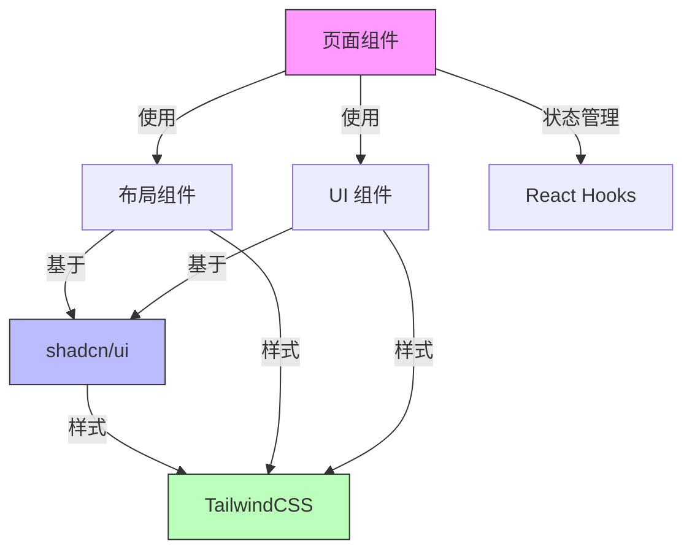

# UI 技术栈模板

<version>1.0.0</version>

## 状态：已批准

## 技术概述

本 UI 技术栈模板定义了一个现代化、可扩展的前端架构方案。采用 Next.js 作为主要框架，结合 TailwindCSS 和 shadcn/ui 组件库，提供了一个强大、灵活且美观的用户界面解决方案。

## 技术选型表

| 技术        | 版本   | 说明                                |
| ----------- | ------ | ----------------------------------- |
| Next.js     | 14.1.0 | React 框架，用于构建现代化 Web 应用 |
| React       | 18.2.0 | 用户界面构建库                      |
| TailwindCSS | 3.4.1  | 原子化 CSS 框架，用于样式开发       |
| shadcn/ui   | latest | 基于 Radix UI 的组件库系统          |
| TypeScript  | 5.3.0+ | JavaScript 的超集，提供类型安全     |
| ESLint      | 8.x    | 代码质量检查工具                    |
| Prettier    | 3.x    | 代码格式化工具                      |

## UI 架构图



## 组件设计规范

### 组件目录结构

```
/components
├── /ui              # shadcn/ui 基础组件
│   ├── button.tsx
│   ├── card.tsx
│   └── ...
├── /common          # 通用业务组件
│   ├── header.tsx
│   └── footer.tsx
├── /features        # 功能特定组件
│   ├── /auth
│   └── /dashboard
└── /layouts         # 布局组件
    ├── main-layout.tsx
    └── auth-layout.tsx
```

### 样式规范

```typescript
// 组件样式示例
const Button = ({ className, ...props }: ButtonProps) => {
  return (
    <button
      className={cn(
        'inline-flex items-center justify-center rounded-md text-sm font-medium',
        'focus-visible:outline-none focus-visible:ring-2',
        'disabled:opacity-50 disabled:pointer-events-none',
        className
      )}
      {...props}
    />
  )
}
```

## 项目结构

```
/
├── /src
│   ├── /app          # Next.js App Router 路由
│   │   ├── layout.tsx
│   │   └── page.tsx
│   ├── /components   # React 组件
│   │   ├── /ui
│   │   ├── /common
│   │   └── /features
│   ├── /lib         # 工具函数和配置
│   │   ├── utils.ts
│   │   └── constants.ts
│   ├── /hooks       # 自定义 Hooks
│   ├── /styles      # 全局样式
│   └── /types       # TypeScript 类型定义
├── /public          # 静态资源
├── components.json  # shadcn/ui 配置
├── tailwind.config.js
└── tsconfig.json
```

## 开发规范

### 组件开发规范

1. 使用 TypeScript 开发所有组件
2. 遵循 React 最佳实践和 Hooks 规范
3. 使用 shadcn/ui 作为基础组件库
4. 采用 TailwindCSS 进行样式开发

### 样式开发规范

1. 优先使用 TailwindCSS 类名
2. 遵循移动优先的响应式设计
3. 使用 CSS 变量进行主题定制
4. 保持一致的命名规范

## 更新日志

| 更新内容     | Task ID | 说明                   |
| ------------ | ------- | ---------------------- |
| 初始模板创建 | N/A     | 创建初始 UI 技术栈模板 |
